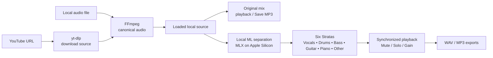

# Strata


Native macOS app for separating audio into six synchronized stems and mixing them.

Load a YouTube source or a local audio file, play the original, optionally separate it into stems, then mix and export. Audio separation runs locally on this Mac; you do not need to separate a source just to play it or export its original audio as MP3.



## What it does

- Load and play an original mix from YouTube or a local audio file.
- Optionally separate the source into **Vocals, Drums, Bass, Guitar, Piano, and Other**.
- Play the six stems together on one shared timeline.
- Mix with per-stem mute, solo, and 0–100% gain controls.
- Export the original source as MP3, or export individual stems and selected mixes as WAV or MP3.
- Edit MP3 tags and artwork before exporting.

## Get audio

### YouTube

1. Paste an `https://` YouTube URL (`youtube.com` or `youtu.be`) into **Paste YouTube URL**.
2. Click **Load source**.

Strata uses `yt-dlp` to download the source and its available metadata/artwork, then uses FFmpeg to create and validate local audio for the app. Loading a source does not start separation. The loaded card provides original-source playback and, when available, title, artist, channel, and artwork.

After loading, you can use the same local source to:

- **Separate** it into six stems. This reuses the loaded audio and needs the local worker, but not another YouTube download.
- **Save MP3** without separating. This reuses the loaded audio and needs FFmpeg.

Loading a new YouTube URL downloads that source. **Load source** requires both FFmpeg and `yt-dlp`.

### Local file

Click **Add Audio** and choose an audio file. The picker accepts common audio types including MP3, WAV, AIFF, and M4A. The selected file is loaded immediately as the **Original mix** with its filename, duration, and play/pause/seek controls when macOS can decode it.

With a local file loaded, you can:

- **Separate** it. Strata uses FFmpeg to convert it to the canonical audio format needed by the local separation worker, then runs separation locally.
- **Save MP3** without separating. FFmpeg encodes the selected local file directly.

Only one source is active at a time. Choosing a different source clears the previous source's separation result and status.

## Playback and seeking

- The original mix has play/pause, a seek slider, and a time display. Seeking while playing resumes from the new position. After natural completion, Play starts again from the beginning.
- Separated stems stay synchronized on one shared timeline. The compact stems controls, stacked strata view, shared ruler, and any stem waveform can be used to play, pause, or seek all six stems together.
- Times are shown as `m:ss`, or `h:mm:ss` for longer audio.

## Optional six-stratum separation

Separation produces six validated, synchronized stems in this order:

**Vocals → Drums → Bass → Guitar → Piano → Other**

The strata view shows a real waveform for each stem, a shared ruler, and a shared playhead. Click or drag any waveform or the ruler to seek all stems together. The separation status moves through states such as `Ready`, `Downloading…` for YouTube sources, `Loading model…`, `Separating…`, `Complete`, `Failed`, and `Cancelled`. **Cancel** stops the current operation.

## Mixing

Each stem row has:

- **Mute** and **Solo** controls.
- A live **Gain** slider from `0%` to `100%`.

When one or more stems are soloed, only those stems are used for playback and selected-mix export. Otherwise, muted stems are excluded and the remaining stems are used. Gain affects live stem playback and the selected mix export. A selected mix requires at least two stems, and loading a new source resets the stem controls.

## Export

Exports open a save panel. **Export Folder…** sets the default folder shown by future export panels.

### Original source → MP3

- **YouTube source:** use **Save MP3** on the loaded source card. It reuses the downloaded local audio and does not run another `yt-dlp` download.
- **Local file:** use **Save MP3** beside **Separate**. It encodes the selected local file directly.

Original-source MP3 export does not require separation, but all MP3 exports require FFmpeg.

### Individual stem → WAV or MP3

Use the download menu on a stem row to choose WAV or MP3.

- WAV exports copy the validated stem and do not require FFmpeg.
- MP3 exports encode the stem with FFmpeg and can include the current MP3 tags and artwork.

### Selected mix → WAV or MP3

Use **Export Selected MP3** or the menu beside it for **Export Selected WAV**. The selected stems come from the current Mute/Solo state, with Solo taking precedence, and at least two stems must be selected. MP3 mix export requires FFmpeg; WAV mix export does not. Mix export uses the current per-stem gains and keeps the stems aligned.

WAV exports do not contain MP3 tags.

## MP3 tags and filenames

The **MP3 Tags** editor is available for local files and for YouTube sources when metadata is available. It includes **Title, Artist, Album, Album Artist, Year, Track #, Genre**, and artwork controls: **Keep**, **Remove**, or **Replace…**.

Edits are used by MP3 exports for the current source. WAV exports do not carry tags. Blank, `na`, and `n/a` values are omitted; Year accepts four digits, and Track # accepts `n` or `n/m` with positive integers. **Keep** uses available source artwork, **Remove** exports without artwork, and **Replace…** uses the selected image.

Default save names are based on the available metadata and source:

- Original-source MP3: `Artist - Title.mp3` when a metadata-based name is available; otherwise `YouTube Audio.mp3` for YouTube or the local source name, falling back to `Audio.mp3`.
- Individual stem: `Artist - Title - Vocals.mp3` or `.wav` when a source name is available; otherwise `vocals.mp3` or `vocals.wav`.
- Selected mix: the source name followed by the selected stem names, such as `Artist - Title - Vocals + Guitar.mp3`; without a source name, a name such as `Vocals + Guitar.mp3` is used.

The save panel lets you change any default filename before exporting.

## Prerequisites

**Supported platform:** Apple Silicon Mac (arm64) running macOS 26 (Tahoe) or later. Intel Macs are not supported — the ML worker asserts `arm64` and uses MLX/Metal on MPS. The Xcode project deployment target is `26.0` (Swift 6).

**Required tools:**

- **Xcode** — from the Mac App Store (includes Command Line Tools). Strata builds with the `Strata` scheme in `Strata.xcodeproj` and uses the macOS 26 SDK.
- **Homebrew** — from <https://brew.sh> (Apple Silicon path `/opt/homebrew/bin`).

If Homebrew was just installed and this terminal does not yet find `brew`, initialize the Apple Silicon Homebrew environment before continuing:

```bash
eval "$(/opt/homebrew/bin/brew shellenv)"
```

**Supported external versions** (pinned in `Strata/Inference/ExternalToolCompatibility.swift`):

| Tool | Supported version | Path / role |
|------|-------------------|-------------|
| FFmpeg | `9.0.1` | `/opt/homebrew/bin/ffmpeg` — externally installed runtime dependency |
| yt-dlp | `2026.08.19` | `/opt/homebrew/bin/yt-dlp` — externally installed runtime dependency |
| Node.js | `26.8.1` | `/opt/homebrew/bin/node` — externally installed runtime dependency |
| uv | `0.12.8` | `uv` — used to create `InferenceWorker/.venv` (not called at runtime) |

FFmpeg, yt-dlp, and Node are externally installed runtime dependencies Strata executes at `/opt/homebrew/bin/*`. `uv` is only used to prepare the local Python worker environment (`InferenceWorker/.venv` from `InferenceWorker/pyproject.toml` / `uv.lock` / `.python-version`). **Model files and third-party executables are not bundled in the repository or in `Strata.app`.**

Install the external tools in one command:

```bash
brew install ffmpeg yt-dlp node uv
```

Homebrew installs its current formula versions; this command does not itself pin Strata’s supported versions. Strata validates the supported FFmpeg, yt-dlp, and Node runtime versions at their fixed `/opt/homebrew/bin` paths and rejects an unsupported version rather than silently running an unvalidated one. `uv` is a setup prerequisite and is not called by the app at runtime.

Before continuing, confirm that the exact executables Strata uses report the supported versions:

```bash
brew --prefix                         # expect: /opt/homebrew
command -v uv                         # expect: /opt/homebrew/bin/uv
/opt/homebrew/bin/ffmpeg -version | head -n 1  # expect: ffmpeg version 9.0.1
/opt/homebrew/bin/yt-dlp --version             # expect: 2026.08.19
/opt/homebrew/bin/node --version               # expect: v26.8.1
uv --version                                  # expect: uv 0.12.8
```

If any expected version differs, stop here and resolve it as described in [Troubleshooting](#troubleshooting) before cloning or running the app.

## Build from source

Run the shell commands below in one continuous terminal session. Start in any directory where you want the checkout; the commands themselves establish the later working directories. If a command fails, stop and fix it before continuing.

### Clone

```bash
git clone https://github.com/mbuckingham74/strata.git
cd strata                 # now: the cloned repository root
```

SSH alternative: `git@github.com:mbuckingham74/strata.git`.

### Prepare the Python worker

The pinned Python version is in `InferenceWorker/.python-version` (`3.12.12`). From the repository root:

```bash
cd InferenceWorker        # now: <repository root>/InferenceWorker
uv sync                   # stays in <repository root>/InferenceWorker
uv run prepare-model      # stays in <repository root>/InferenceWorker
cd ..                     # now: <repository root>
```

- `uv sync` creates `InferenceWorker/.venv` (downloads the pinned Python via `uv` if needed) from `InferenceWorker/pyproject.toml` and `InferenceWorker/uv.lock`.
- `uv run prepare-model` downloads and verifies model assets into `~/Library/Caches/Demux/Models/roformer-model-bs-roformer-sw-by-jarredou/` — **~667 MB checkpoint `BS-Rofo-SW-Fixed.ckpt` (699,412,152 bytes) + ~5 KB config**, ~670 MB total, SHA-256 verified (see `InferenceWorker/src/demux_worker/constants.py`). The worker does **not** download models automatically; this step is required before the first separation. Re-running is idempotent — valid cached files are skipped.
- To validate cached assets without downloading, run `uv run prepare-model --check-only` while the current directory is `InferenceWorker` (the troubleshooting sequence shows the required `cd` commands).

When running a Debug build from Xcode, Strata looks for `InferenceWorker/.venv` in the repository. If the worker lives elsewhere, set `DEMUX_WORKER_DIRECTORY` to its absolute `InferenceWorker` directory in Xcode under **Product ▸ Scheme ▸ Edit Scheme… ▸ Run ▸ Arguments ▸ Environment Variables**. A worker is needed for separation; WAV exports remain available without FFmpeg once stems exist.

The app shows setup status in the sidebar and Separation card. Missing or unsupported FFmpeg disables YouTube loading, local separation, and MP3 exports; missing or unsupported yt-dlp/Node disables YouTube; missing the worker disables separation.

### Run in Xcode

The preceding `cd ..` leaves the terminal in the repository root:

```bash
open Strata.xcodeproj  # run this from the repository root
```

In Xcode, select scheme **Strata**, destination **My Mac**, then choose **Product ▸ Run** (⌘R). If Xcode asks to accept its license or install platform components, complete those prompts and run again.

No separate metadata-generation step is required — the `AboutMetadata.json` build phase invokes `python3` on `scripts/generate-about-metadata.py` automatically with `${SRCROOT}`-absolute repository paths.

### First run

On first launch, click **Add Audio** for a local file or paste a YouTube URL into **Paste YouTube URL** and click **Load source**. Check the setup status if you plan to separate audio. Separation will show `Loading model…` → `Separating…` once the cached model is present; if `prepare-model` was not run, separation reports the missing cache and will not download it.

> Model files (`~/Library/Caches/Demux/Models/...`) and the Homebrew executables (`/opt/homebrew/bin/ffmpeg`, `/opt/homebrew/bin/yt-dlp`, `/opt/homebrew/bin/node`) are not committed and are not embedded in the app — they must be present as described above.

## Troubleshooting

Run the checks below from the repository root. If you followed the build sequence, the terminal is already there after `cd ..` in worker setup. The worker check must run from `InferenceWorker`, where its `pyproject.toml` is located, and the final `cd ..` returns to the repository root.

```bash
# Current directory: repository root
brew --prefix                         # expect: /opt/homebrew
command -v ffmpeg yt-dlp node uv       # expect: /opt/homebrew/bin/*
ls -l /opt/homebrew/bin/ffmpeg /opt/homebrew/bin/yt-dlp /opt/homebrew/bin/node
/opt/homebrew/bin/ffmpeg -version | head -n 1  # expect: ffmpeg version 9.0.1
/opt/homebrew/bin/yt-dlp --version             # expect: 2026.08.19
/opt/homebrew/bin/node --version               # expect: v26.8.1
uv --version                                  # expect: uv 0.12.8

cd InferenceWorker                    # now: <repository root>/InferenceWorker
ls -l .venv/bin/python3
cat .python-version                    # expect: 3.12.12
uv run prepare-model --check-only      # validates cache without downloading
cd ..                                  # now: <repository root>
```

- `Setup needed · missing FFmpeg at /opt/homebrew/bin/ffmpeg` or `Setup needed · FFmpeg version mismatch …` → install or make the supported FFmpeg `9.0.1` available at that exact path. Intel Homebrew at `/usr/local/bin` is not used.
- `YouTube disabled · missing yt-dlp at /opt/homebrew/bin/yt-dlp` or `YouTube disabled · yt-dlp version mismatch …` → make yt-dlp `2026.08.19` available at that exact path.
- `YouTube disabled · missing Node at /opt/homebrew/bin/node` or `YouTube disabled · Node version mismatch …` → make Node `26.8.1` available at that exact path.
- Homebrew formulae advance independently of this repository. `brew upgrade` does not guarantee one of the supported versions; if the current formula is newer, install a supported versioned formula or another supported package source, then rerun the absolute-path checks. The repository does not include a Homebrew version pin or downgrade installer.
- `Setup needed · missing worker Python at …/.venv/bin/python3` → from the repository root, run `cd InferenceWorker`, then `uv sync`, then `cd ..`. Do not run `uv sync` from the repository root.
- A worker error about a missing cached asset → from `InferenceWorker`, run `uv run prepare-model` (without `--check-only`) to download and verify the model files.
