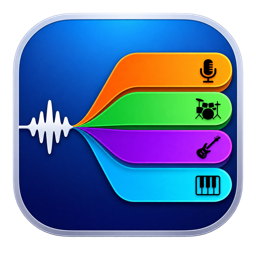
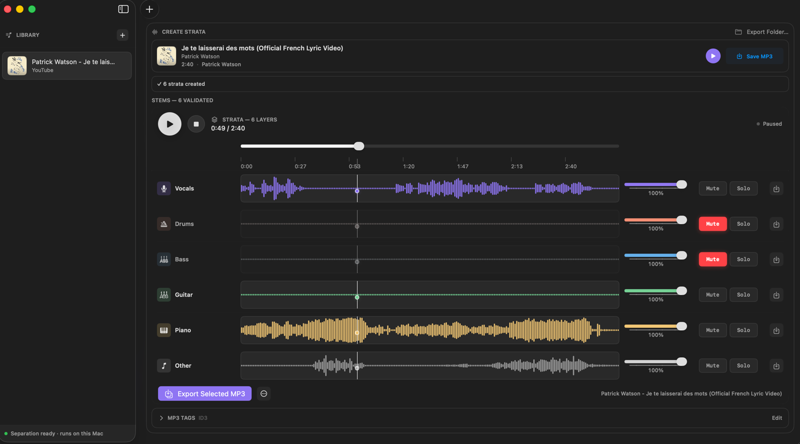
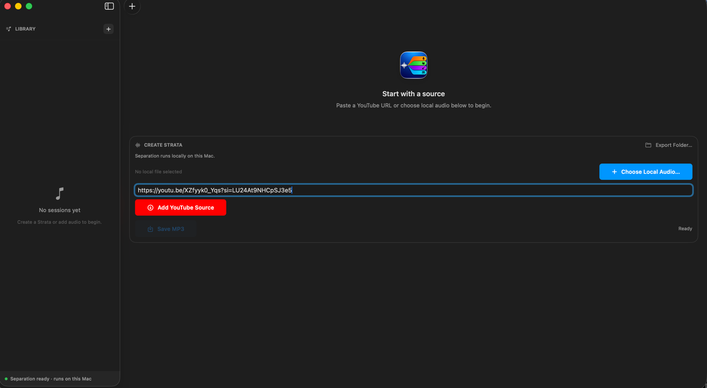

# Strata

Turn a song into six synced strata you can mute, reshape, and export.

Native macOS app · Apple Silicon · Separation runs locally on-device (fetching a YouTube Source needs network).

## Features

- Start from a YouTube link or local audio file.
- Play local audio immediately as the Original mix; separation is optional.
- Create Strata to split a Source into six synced strata: Vocals, Drums, Bass, Guitar, Piano, Other.
- Mix with per-stratum mute, solo, and gain on one shared timeline.
- Export the original as MP3, or export stems and selected mixes as WAV or MP3.
- Reopen any Library session later without separating again.

## How it works

1. **Pick a Source** — add local audio or preview a YouTube link.
2. **Create Strata** — run local separation when you want stems.
3. **Mix** — mute, solo, and balance the six strata together.
4. **Export or reopen** — Save MP3, Export stems and mixes, or reopen the saved Library session later.

## Sources

### Local audio

Use **Choose Local Audio…** and pick a file macOS can decode (such as MP3, WAV, AIFF, or M4A). It loads immediately as the **Original mix** with title, duration, and play, pause, and seek controls.

From there you can **Save MP3** directly or **Create Strata** to separate it. Only one Source is active at a time; picking a new Source clears the previous separation result and status.

### YouTube, metadata first

Paste an `https://` YouTube URL (`youtube.com` or `youtu.be`) and choose **Add YouTube Source**.

That first step is a lightweight preview only: title, artist, channel, artwork, and duration. The preview is **not playable** — playback controls stay disabled and show **Preview only**. **Save MP3** does not make it playable; only **Create Strata** acquires the canonical Original mix.

From the preview card you can:

- **Create Strata** — downloads the audio once, then runs local separation.
- **Save MP3** — downloads the audio once as an export intermediate, then encodes an MP3 without separating and without loading a playable source.

Loading a new URL replaces the previous preview. The preview step needs only yt-dlp + Node; FFmpeg is needed later for acquisition/export/separation paths that use it.

## Mixing and playback

The **Original mix** has play/pause, a seek slider, and a time readout (`m:ss`, or `h:mm:ss` for long audio). Seeking while playing resumes from the new position; after natural completion, Play restarts from the beginning.

After separation, the six strata share one timeline:

- Waveforms, shared ruler, and shared playhead stay in sync; click or drag any of them to seek all strata together.
- Each stratum row has **Mute**, **Solo**, and a live **Gain** slider (`0%`–`100%`).
- When any stratum is soloed, only soloed strata play and count toward the selected mix. Otherwise, muted strata are excluded.
- Gain affects both live playback and the Exported selected mix.
- A selected mix needs at least two strata.

Loading a new Source resets the mixer controls. Only the saved gains travel with a Library session (see Library); mute, solo, and playhead position are not persisted.

## Library

A successful **Create Strata** saves a **Library session** (also called a saved session). **Save MP3** alone does not create one.

The **Library** sidebar lists saved sessions by most-recently opened, with title, a YouTube/Local label, and artwork when available. Selecting a session reopens it **without downloading, ingesting, or separating again**, restoring source playback, the completed separation, persisted project metadata/artwork where present, and saved gains. Later MP3 tag edits are not generally persisted.

- **New Session** (`+`) clears the active Source, separation state, stems, and draft URL.
- **Delete** (right-click a session) asks for confirmation and permanently removes that session and its audio files.
- Re-running **Create Strata** for the same YouTube video updates that video’s existing Library row instead of adding a duplicate. Local files create a new row per completed separation.

<!-- Screenshot 3 — expected file: docs/readme/library-reopen.png — Library session switching/reopen sequence: sidebar with multiple saved sessions, selecting an older session, mixer restored without re-separating. -->

## Export

Exports open a save panel. **Export Folder…** sets the default folder shown by future export panels; you can still pick any destination each time.

- **Original → Save MP3** — on the Source card. Needs no separation.
- **Single stratum → WAV or MP3** — from the download menu on a stratum row.
- **Selected mix → Export Selected MP3 / Export Selected WAV** — exports the strata currently selected by Mute/Solo (Solo wins), with current gains, kept in sync. Needs at least two strata.

Individual stem WAV export copies the validated stem, while selected-mix WAV export is rendered from the chosen stems with current gains; neither needs FFmpeg. MP3 exports are encoded with FFmpeg. WAV files do not carry MP3 tags.

### MP3 tags and quality

The **MP3 Tags** editor is available for the current Source, including local audio and previews without metadata. It covers Title, Artist, Album, Album Artist, Year, Track #, Genre, and artwork (**Keep** / **Remove** / **Replace…**). Edits apply to MP3 exports for that Source; blank values are omitted.

**Settings → MP3 Quality** applies to all MP3 exports (default **High (VBR)**; optional 192 / 256 / 320 kbps). WAV is always lossless.

A metadata-derived source prefix (`Artist - Title`) is used only when both Artist and Title are available (for example, `Artist - Title - Vocals + Guitar.mp3`); otherwise local stem/mix exports may fall back to names such as `Vocals.mp3` or `Vocals + Guitar.mp3`. The save panel lets you rename before exporting.

## First run

On first launch Strata shows **Set Up Strata**. It prepares what the app needs on your Mac — FFmpeg, yt-dlp, Node, the separation engine, the model, and a final check. This can take a few minutes and may need network access to download tools, worker dependencies, and model assets; there is nothing else to install by hand.

The checklist shows each step as Pending, Preparing, Ready, or Couldn’t finish, with **Try Again** on failure and **Strata is ready** on success. Setup status also appears in the sidebar. Missing pieces gate gracefully: without yt-dlp/Node there is no YouTube preview or loading; without FFmpeg there is no acquisition, local separation, or MP3 export; without the worker/model there is no separation.

## Settings

- **Appearance** — Theme.
- **MP3 Quality** — High (VBR), 192, 256, or 320 kbps for all MP3 exports.
- **Locations** — Library, Scratch, and Export folders with Choose…/Reset. Save panels open in the Export folder. Scratch applies to new separations and ingests only; existing data is not moved. The Settings → Library location preference currently neither moves existing sessions nor retargets project persistence; saved projects remain under `~/Library/Application Support/Strata/Projects`.

## Privacy and technical notes

- Inference is local/on-device (Apple Silicon, MLX/MPS); there is no cloud separation step.
- YouTube preview and download need network access. Everything after that is local.
- Saved Library sessions live under the app’s Application Support folder; temporary ingest/separation work lives under Caches; default exports live under Music.

For developers: builds, tools, and storage

- Build and run with the `Strata` scheme in `Strata.xcodeproj` on an Apple Silicon Mac.
- In-app setup provisions and validates the FFmpeg / yt-dlp / Node tools, the Python separation worker environment, and the model assets. Supported tool versions are checked in-app; no manual installs are required for normal use.
- Storage defaults: Library sessions under `~/Library/Application Support/Strata/Projects`, temporary ingest and separation work under `~/Library/Caches/Strata`, default exports under `~/Music/Strata/Exports`.
- Model: BS-RoFormer-SW; backend MLX on MPS. See Strata → About for the pinned model identity shown by the app.

## Current limits

- YouTube previews show metadata/artwork/duration only and cannot play; only **Create Strata** acquires the canonical Original mix (**Save MP3** does not make the preview playable).
- Separation is optional but required before any stem or selected-mix Export.
- Only one Source is active at a time.
- Selected-mix Export needs at least two selected strata.
- MP3 Export needs FFmpeg ready; YouTube preview needs yt-dlp + Node ready; acquisition/separation paths need their respective tools plus the worker and model.
- Only saved gains persist with a Library session; mute, solo, and playhead position do not.
- The Settings → Library location preference neither moves existing sessions nor retargets project persistence; saved projects remain under `~/Library/Application Support/Strata/Projects`.
- Apple Silicon only; Intel Macs are not supported.

## Acknowledgments

- BS-RoFormer separation model by Jarredou, and the open `bs-roformer-infer` reference.
- MLX and the Apple Silicon / Metal (MPS) ecosystem.
- FFmpeg, yt-dlp, and Node.js, which power local audio handling and YouTube access.
